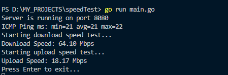

# SpeedTest

A  CLI tool written in Go to measure your internet speed (download, upload, and ping) directly from your terminal. Inspired by speedtest.net, !

---

## 🚀 Features

- **ICMP Ping Test:** Measures latency to Google's DNS (8.8.8.8) using raw ICMP packets for accurate results.
- **Download Speed Test:** Downloads a large file from Cloudflare's speed test endpoint and calculates your real download bandwidth.
- **Upload Speed Test:** Uploads a large buffer to Cloudflare's endpoint to measure your upload speed.
- **Simple CLI:** Just run and get your results instantly—no setup required.


---

## 📦 Installation

1. **Clone the repository:**
   ```bash
   git clone https://github.com/Rassimdou/TestSpeed.git
   cd TestSpeed
   ```
2. **Build:**
   ```bash
   go build
   ```
3. **Run:**
   ```bash
   go run main.go
   ```

---

## 🛠 Usage

Simply run the program:

```bash
go run main.go
```

You will see output like:

```
Server is running on port 8080
Starting ICMP ping test...
ICMP Ping ms: min=10 avg=12 max=15
Starting download speed test...
Download Speed: 95.23 Mbps
Starting upload speed test...
Upload Speed: 20.45 Mbps
Press Enter to exit...
```

---

## 🧩 Project Structure

- `main.go` — Entry point. Starts the server and runs all tests.
- `internal/ping.go` — Implements the ICMP ping test using [go-ping/ping](https://github.com/go-ping/ping).
- `internal/download.go` — Implements the download speed test using Cloudflare's endpoint.
- `internal/upload.go` — Implements the upload speed test using Cloudflare's endpoint.


---

## 📋 Dependencies

- [Go 1.18+](https://golang.org/)
- [go-ping/ping](https://github.com/go-ping/ping)

Install Go dependencies with:
```bash
go mod tidy
```

---


## 📷 Screenshots



*Sample output of running the speedTest CLI tool on Windows*


